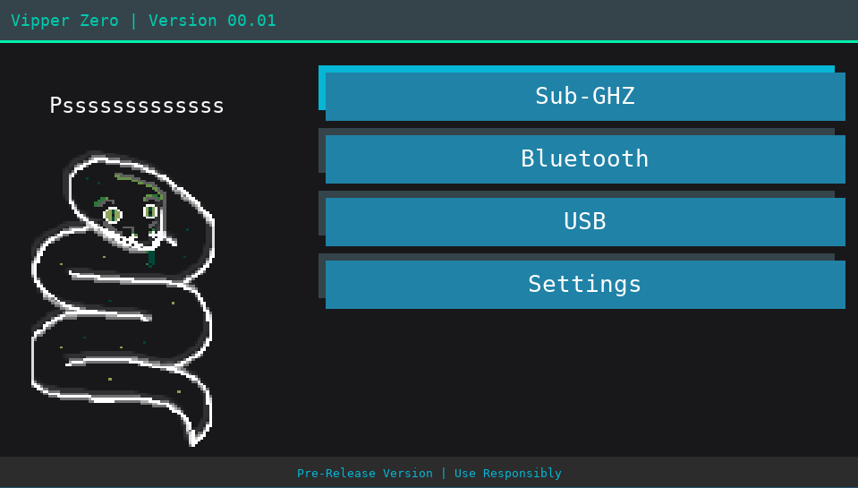

# Vipper Zero


Vipper Zero is a software framework that turns your GNU/Linux device or (jailbroken) PS Vita into hacking swiss-army knife!

It was built with [quark](https://github.com/lp1dev/quark) in HTML/JS and with a bit of C.


*Prerequisite*: The USB injection mode requires the latest [hidkeyboard.skprx](https://github.com/lp1dev/vitakeyboard_fork/releases) to be installed (from [vitakeyboard_fork](https://github.com/lp1dev/vitakeyboard_fork)) as a [**KERNEL** plugin](https://consolemods.org/wiki/Vita:Installing_Plugins).



---

## Hardware setup

The Sub-GHz and Bluetooth sections require an EvilCrow RF v2 with a custom firmware (setup instructions [here](./evilcrowrfv2/)). 
It uses USB serial communication to send instructions to the device and reads /dev/ttyUSB0 by default.

You might need to change this value in the code if you have other USB serial devices.

### PS Vita setup

The console does **not** support USB host mode, so you will need to use another device (such as a Raspberry Pi Zero) as a bridge between the ECRF and the PS Vita.

A [rpi_bridge.py](./evilcrowrfv2/rpi_bridge.py) that does this bridging is provided.

> It requires the **python3-serial** module on Debian-based distribution or the **Python pyserial module**. 


## Install

### GNU/Linux

To run the project on GNU/Linux, you will need to:
- Follow the steps to setup [quark](https://github.com/lp1dev/quark)
- Clone this directory to $YOUR_QUARK_INSTALL_DIRECTORY/projects/VipperZero
- Run make -f Makefile.Linux
- You should now be able to run the project with `./quark`!

> **Note**: I'm working on a more portable version.

### PS Vita

To install on the PS Vita, you will need a jailbroken PS Vita.

Use either your SD card (if you use SD2Vita) or VitaShell's FTP server to add the .vkp file of the latest release available on this GitHub repo to your console and install it using VitaShell.

**Make sure** that you have also setup the **hidkeyboard.skprx** plugin and rebooted your console!

Then, you just need to launch the app and you're ready to go!

## Build

If you want to build the VPK file yourself, you will need [quark](https://github.com/lp1dev/quark), clone it

```bash
git clone https://github.com/lp1dev/quark.git
```

Then, create a *projects* directory and clone *virtualkeyboard* in it.

```bash
cd quark
mkdir projects && cd projects
git clone https://github.com/lp1dev/vita_virtualkeyboard.git
```

Finally, use *docker* to build quark and use it to compile the project:

```
cd ..
docker build -f ./Dockerfiles/Dockerfile -t quark:0.1 .
docker run --rm -v ./projects/:/quark/projects/ -it quark:0.1 /quark/projects/vita_virtualkeyboard/
```


