

# Turning a game console into a hacking device

---

# About the speaker

<pre>
$> whoami

Jeremie Amsellem (Lp1)

------

Hacker,

Reformed mobile/web/IoT developer

PenTester // Information Security Trainer

Founder @Fenrir.pro
</pre>

---

# About this talk (TL;DR)

- In summer 2024, I started writing PS Vita homebrews
- After my first "hello, world"s, I thought that it would be neat to create a framework that would allow creation of homebrews in HTML/JS
- In 2025, as a proof of concept I wrote a hosts/ports scanner for the console using my new framework **quark**
- Today I'm here to present **VipperZero**, a new project turning the console into a hacking device

---

# About the project

<!-- 

It's an idea that came to me after the ban of the FlipperZero in Canada.

The flipper zero is a hacking device that looks like a gaming device.

Wouldn't it be fun to turn a genuine gaming device into a hacking device?

- Plenty to learn for low-level networking RF, BT etc...

+ I have the PERFECT HANDHELD for this: The PS Vita

- Lightweight
- Small
- Big screen
- Tactile
- BT/WiFi Chipset
- Already Jailbroken in MANY ways

 -->

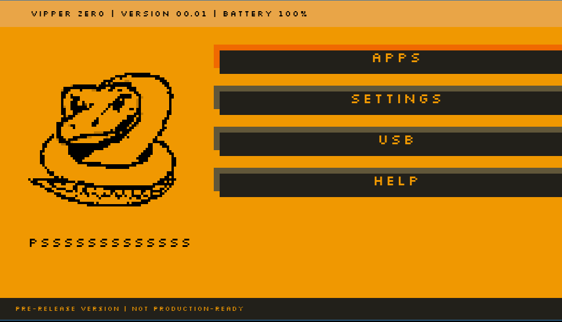

---

# PS Vita Hacking (1/2)

 
 
 
 
 
 
 
 
 
 

<!-- What is considered "hacking" a console?

Usually the objective is to run unofficial software, also called "Homebrews". 

You probably know that If you get in any way arbitrary code execution on a device, 
usually someone will port DOOM to it a few days later.

But the goal is hard to achieve, these devices have only been designed to run signed, official game cartridges or downloaded game packages AND often run their software in 
sandboxed environment.

 -->

<!-- Nowadays, the PS Vita is one of the MOST hacked mobile device, there's thousands of amazing homebrews to add countless features to the console.-->

<!-- TODO: Illustation homebrews -->

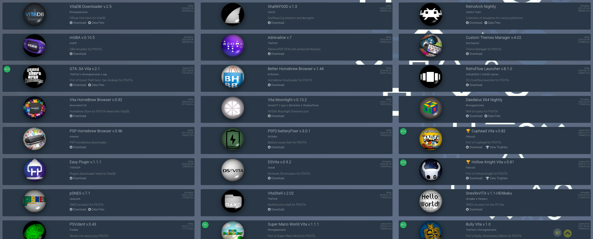

---

# PS Vita Hacking (2/2)

<!-- When it came out in 2012, the ps vita was considered one of the thoughest mobile devices to hack. Its environment has a good separation between what the kernel can do and what the user(s) can do and  

Since it runs a full PSP environment (you can download PSP games on the store and run them, just like normal PS Vita games). They run in a sandbox and since the PSP was sony's most hacked device, hackers started searching on the PSP side of the vita.

The first hacks came from vulnerabilities in games allowing code execution, hackers found them, sony removed the game from the store, in a loop until 2014.

 -->

<!-- TODO: Reference https://wololo.net/2022/07/25/vita-hacking-history/ -->

---

## The big hack

<!-- In september 2014 something happened

A hacker known as qwikrazor87 disclosed an exploit chain (using the game Gladiator begins) that gave him kernel access to the vita's PSP sandbox.

It wasn't the first discovered, it was released it in a hurry because another hacker from his team threatened to leak it.

And a few days later... he did. Acid_Snake, leaked 50 of qwikrazor's exploits ("corruped" game saves).

In terms of quantity, that's probably the biggest exploit leak in the history of playstation hacking.

And for many people it was a huge waste: If people (and Sony) knew about these 50 exploits at the same time, they would be able to patch them all at once, reinforce the security of the console. 

But on the bright side, it forced developers to stop targeting the PSP sandbox and work directly on the vita's firmware itself.

--->

<!-- //TODO Cap done, illustration Acid_Snake -->

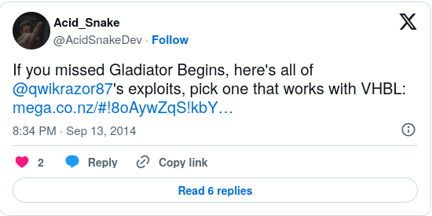

---

## 2015 - A new hope

<!-- 

Early 2015, someone (Hykem) finds an exploit in the way WebKit (that the PS Vita uses) handles URIs.

Some URIs can be used to start existing apps on the console.
 -->

<!-- 

WebKit is a Web Browsing engine, used by safari and multiple consoles.

It has also  been used for jailbreaking the PS3 Wii and Wii U (among others)

-->

<!-- Illustration webkit -->

<!-- But in June, something more impactful happened: the hacker Yifan Lu created Rejuvenate, the first native exploit for the PS Vita allowing code execution -->

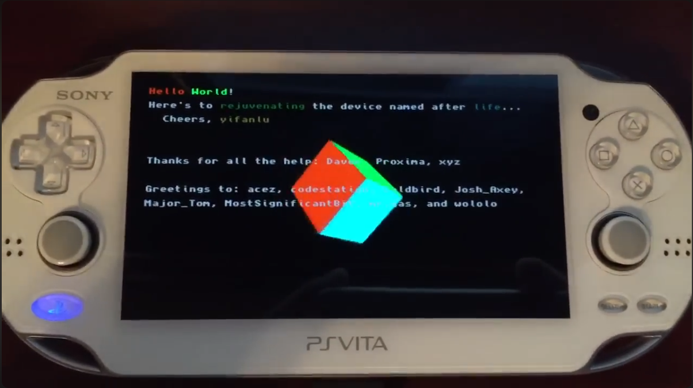

<!-- It totally recreated hope and enthusiasm in the Vita Hacking scene
-->

--- 

## The birth of VitaSDK

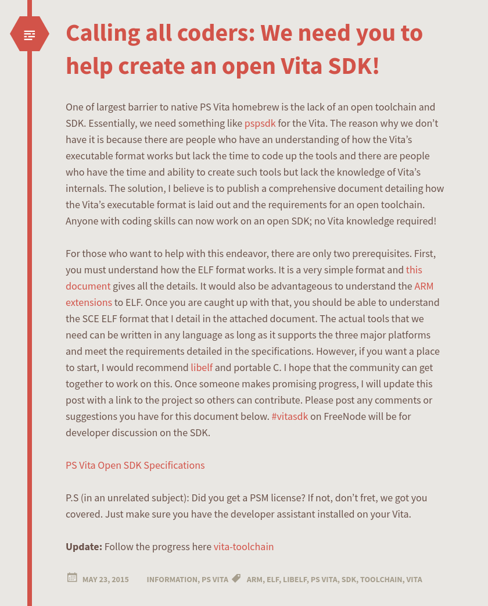

---

## Timeline

- **September 2015**: Arbitrary file write via email attachments
- **May 2015**: VitaSDK is created
- **July 2016**: Henkaku is released
- **July 2017**: Enso is released
- **July 2019**: The PS Vita's encryption is defeated
- **January 2021** : Android ports

<!-- 2016 - Remember the webkit exploit? Henkaku allows hacking your console by browsing a website. But the hack is temporary, if you reboot your console, it's gone. 
Also it requires to have a developer licence because it requires using Sony's official SDK.
-->

<!-- Enso allows instaling a custom firmware, and 2017 is also the year the hacker TheFlow found a way to bypass Sony's DRM  -->

<!-- 2019 - The hacker xyz, without believing it too much bruteforced the key stored in the processor that handles most of encryption tasks on the console.

It was AAAAAAAAAAAAAAAA (16xA)

 -->

 <!-- The story says that hacker TheFlow, semi-drunk and wating to play San Andreas on his vita, created a .so loader a night allowing to boot Android games -->

 <!-- They do require a bit of portage work, but it works! -->

<!-- OpenGL Support, unofficial SDK -->

--- 

## Piracy

<!-- I told you that TheFlow found a way to completly bypass Sony's DRM. Well more importantly, someone else noticed that the PS vita was downloading packages from Sony's server directly when downloading a game, without verifying of the device/user actually owns the game. 

The console is the one that actually make this verification. But with the DRM broken... -->

<!-- Long story short, you can just download a game package on Sony's servers and run it on your console. Thanks Sony! -->

<!-- As of today (I guess because it can't really fixed without re-designing the whole package download system on the console), it still has not been fixed by sony.-->

<!-- //TODO screenshot pkgj 

https://github.com/blastrock/pkgj

-->
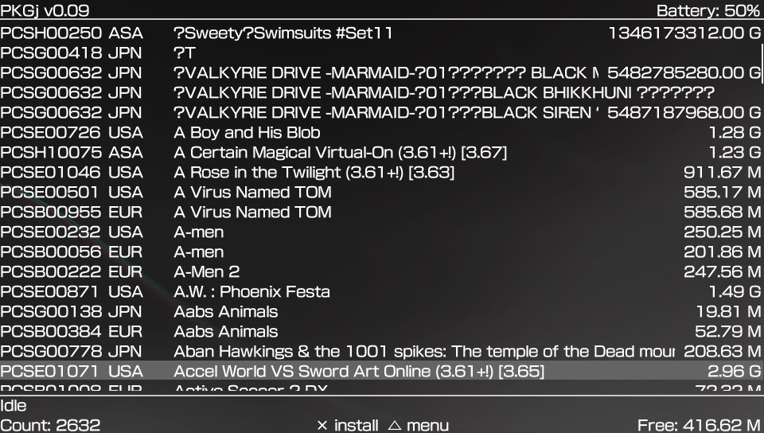

---

# Writing software for the PS Vita in 2026

<!-- //TODO illustration vitaSDK -->

<!-- Nowadays we are lucky enough to have a complete PS vita SDK that even though it's unofficial is very complete -->

<!--  -->

<!-- //TODO screen wiki + samples vitaSDK -->

<!-- We only have this thanks to people reverse engineering the ps Vita's firmware. -->

---

## Hello, world

<!-- At first, I created simple apps using a graphics lib that I like: SDL.

I was happy.

But after writing a few hundred lines of kind of redundant C code, I wondered if I couldn't make my life _easier_//10 times harder

That's when things went wrong.

What if... Instead of building my interfaces in SDL by creating structures in memory for my squares, fonts, colors.

I had a tool to building them in HTML/CSS? It would also be cool to be able to dynamically add logic with JavaScript code for instance, really, how hard could it be??

 -->

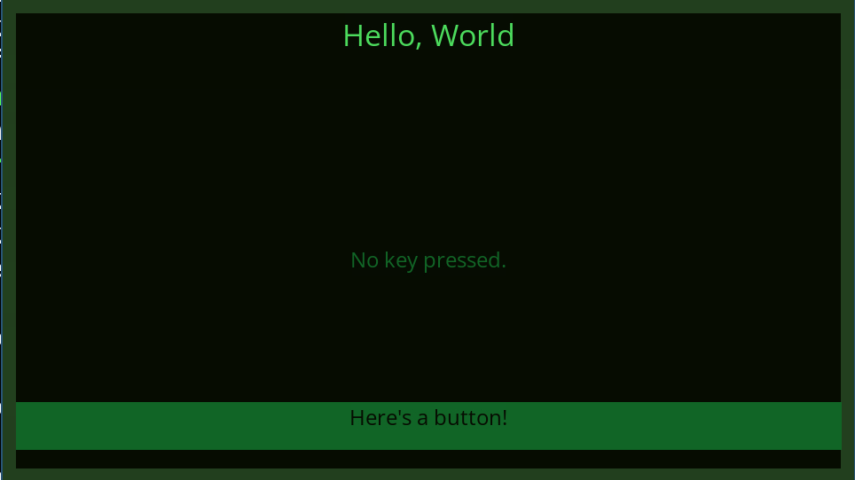

---

## Horrendous Text Markup Language 

<!-- If you're thinking that a good knowledge of network protocols and of the HTML standards are enough to make a HTML renderer without going insane. You're probably wrong. -->

<!-- Just supporting the body, header and div tags with a bit of CSS is geometry and parsing hell.-->

<!--  -->

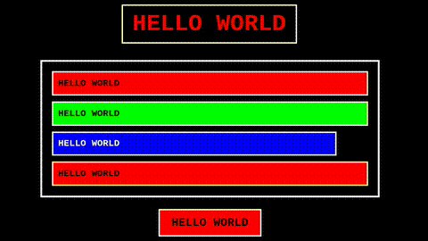

---

# What I've built

## Quark

<!-- That's why I've based the code of my framework quark on an existing HTML renderer -->

- Lexbor (HTML)
- Duktape (JS)
- SDL 

<!-- 
Lexbor that is used by PHP on the latest versions.
 -->

<!-- Same for the JS, building a JS engine is a whole new project by itself so I'm using duktape that is a JS engine built for devices with not a lot of memory, so perfect for our use case-->

<!-- 

And since I'm using the SDL that is multi-platform;

With quark I can run and design complex interfaces and test them directly on my Linux computer.

-->

<!-- //TODO prepare simple demo where I run a sample (with not a lot of files in the dir to understand how it works) app on quark in the VM -->

<!-- Show some code too -->

<!-- After building a few demos I was happy with -->

---

## Vita Ports Scanner

<!-- //TODO screen -->

<!-- I wanted to learn more about the low-level I/O capabilities of the console; well I was into the hard subjects right away!

Timing issues, locked threads, random crashes.

It's network dev but without the documentation. 

 -->

<!-- 
 
//TODO Show screen with the results from ddg (3 results)

 -->

<!-- 3720 downloads on the unofficial store VitaDB -->

<!-- //TODO show somewhere what it looks like when an app crashes on the vita -->

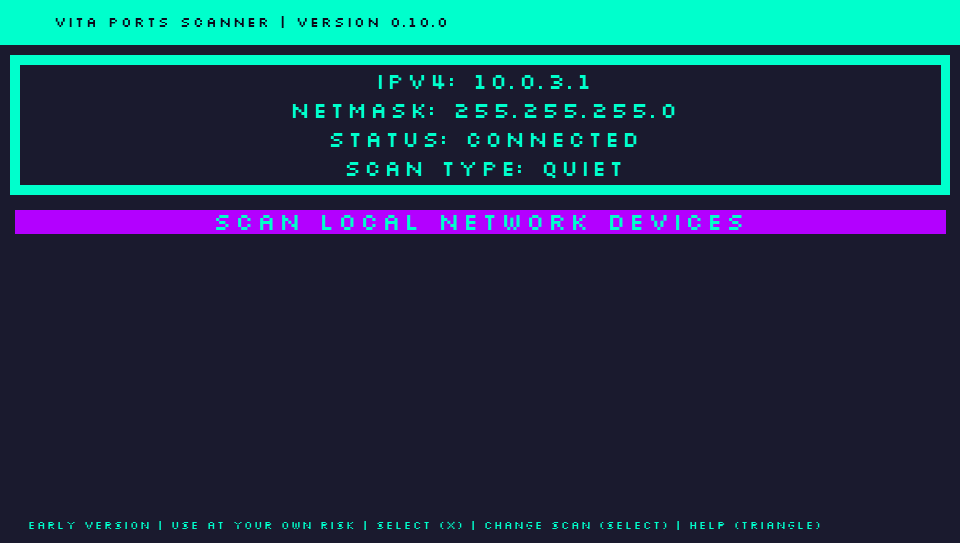

---

## Vita Keyboard

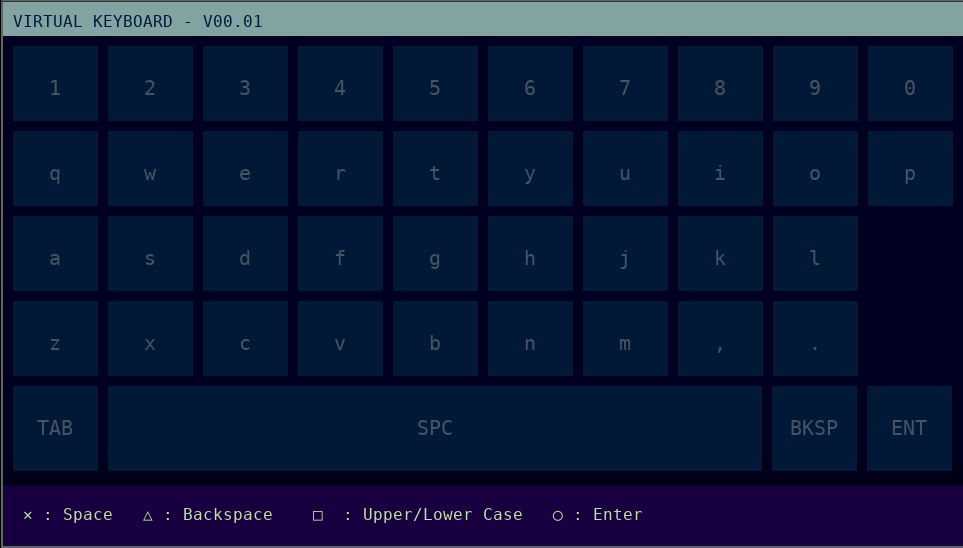

---

## Vipper Zero

<!-- Now that I had these pieces together, I know what my next goal was: I was ready to build my Flipper Zero clone and try to fit as much as the features the flipper has in the console -->

<!-- I even had started forking on the UI, which might be slightly inspired from something. -->

---

### Ideas

- I know how to send keyboard inputs, now I just need to parse duckyscripts for BadUSB functionality
- The PS Vita already has a Bluetooth chipset, I should be able to use the corresponding APIs
- Maybe I can use an external device plugged into the vita for the SubGHz features?

<!-- And speaking of external device, I thought of the EvilCrowRFV2 that I've been using to scan/read/replay radio data in the past -->

---

### EvilCrowRF-V2

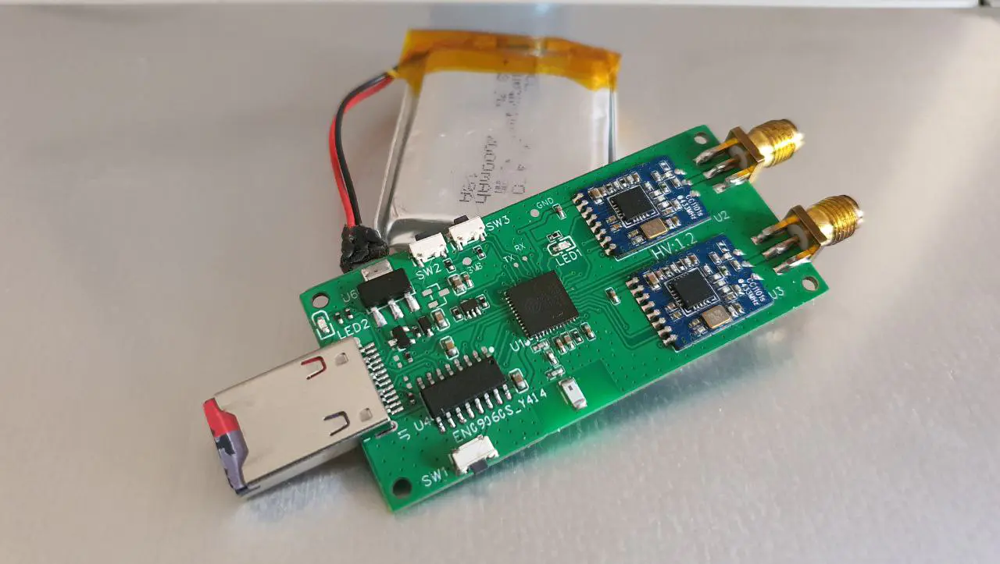

<!-- 1 esp32 -->
<!-- 2 CC1101 radio modules -->
<!-- 1 NRF24L01 module for the 2.4GHz  -->

---

### Problems

- The bluetooth chipset is OLD...
- We don't have low level access to it anywhere in the SDK
- The EvilCrowRF cannot be used via USB

<!-- That is actually a problem because I really wanted the ECRF to be connected to the vita, a bit like the hats on the Flipper Zero -->

<!-- And yes, I could just have connected to the ECRF via WiFi but 1: I think that's less cool, that's less stealthy (we're exposing a network) and if you still think I like to make my life easier, you clearly didn't follow -->

---

### Solutions

- Rewrite a firmware for the ECRFv2 to communicate with it using USB Serial
- Use the NRF24L01 (2.4GHz) module on the Evilcrow for the Bluetooth exploits

<!-- 2.4GHz: that's the frequency used by Bluetooth Low Energy -->

---

### More problems
- The PS Vita does **not** provide any output voltage and cannot act as a USB host (AFAIK)

<!-- We cannot connect external devices via the PS Vita USB, the ps vita IS THE DEVICE supposed to be connected to a computer -->

- The firmware I built for the ECRFv2 does not make it a USB host either and I don't know how if it's even possible to make it a USB host

<!-- I discovered that the PS Vita CAN act as a USB client and send USB serial data though. -->

<!-- It's like having two usb keyboards and somehow wanting to make them communicate...
 -->

<!-- What if I plugged the ps vita and the ECRF to a host that passes data from one to the other?

 -->

<!-- You might think it's stupid: IT IS, but also it works -->

---

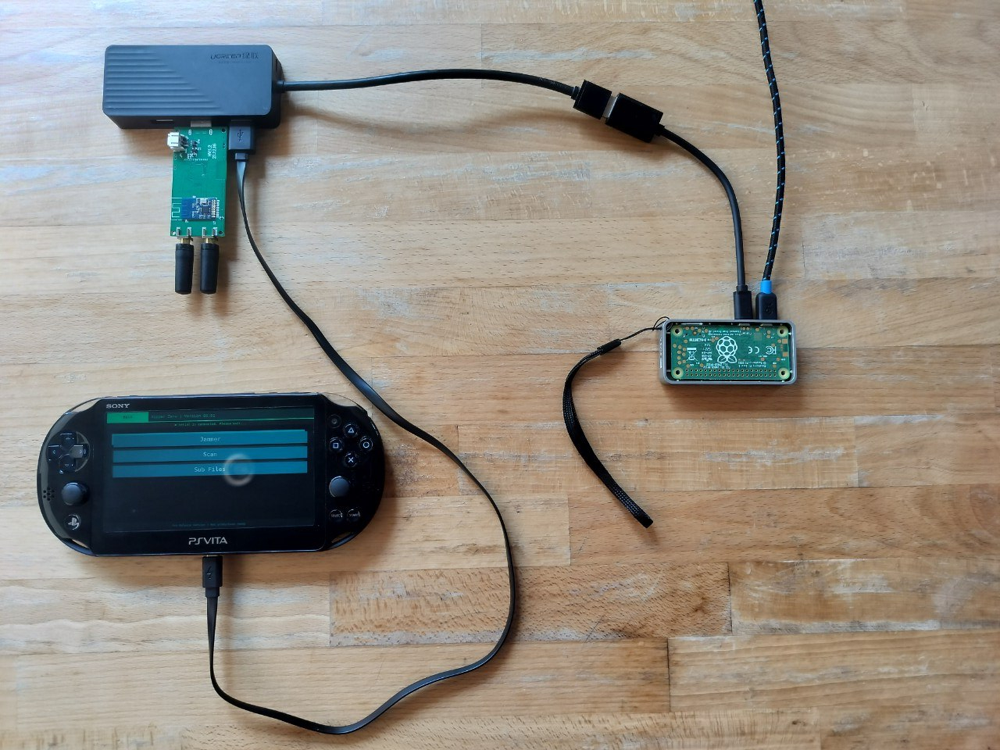

---

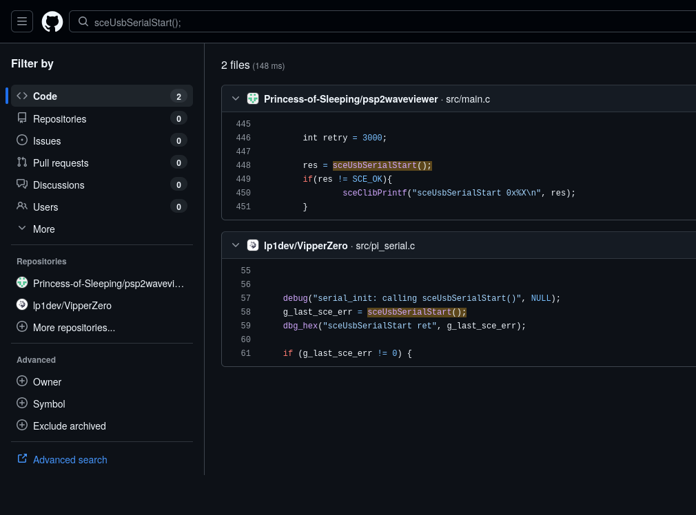

---

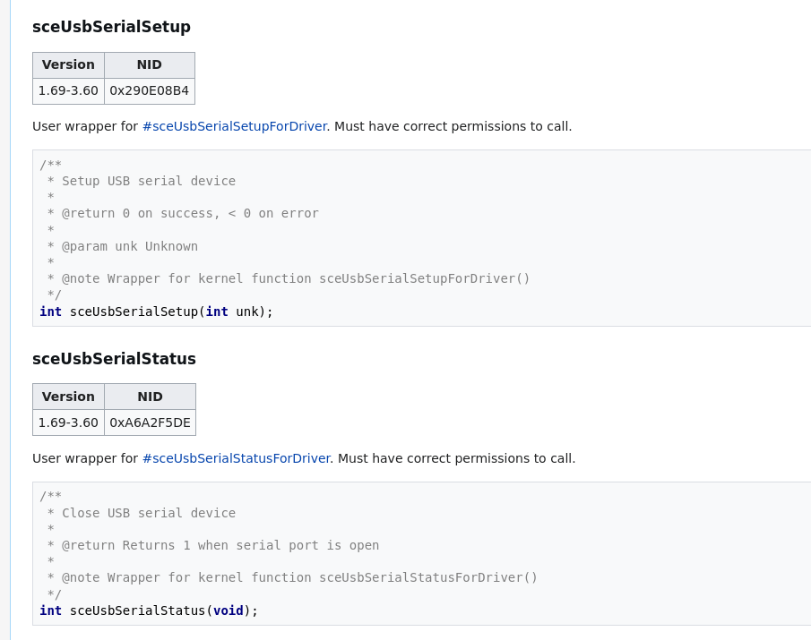

<!-- Cherry on the cake: the PS Vita does not send a valid serial USB header, it causes a crashe of the USB stack on my machine when I plug it in in serial mode -->

---

# Future plans for the project

- Reach a fully stable version 1.0
- Design/3d print a case for the components
- Implement the ECRF's whole feature set
- Support new devices (Nintendo Switch?) 

---

# We need you!

---

# Thanks!

- You
- wololo.net
- //TODO list people in the PS Vita community

# Links

https://github.com/lp1dev/quark
https://github.com/lp1dev/VipperZero

https://lp1.eu